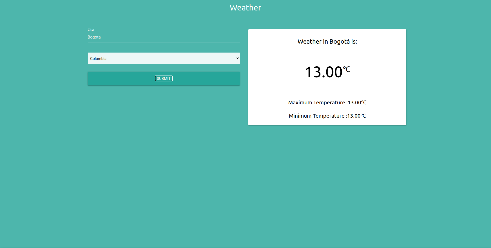

# Open Weather app

## Installation of dependencies

```bash or fish
npm install
```

## Usage

```bash or fish
npm run start
npm run build
```

## Captures



## Live demo

[here you can try the app](https://gifted-snyder-6e31d7.netlify.app/)
